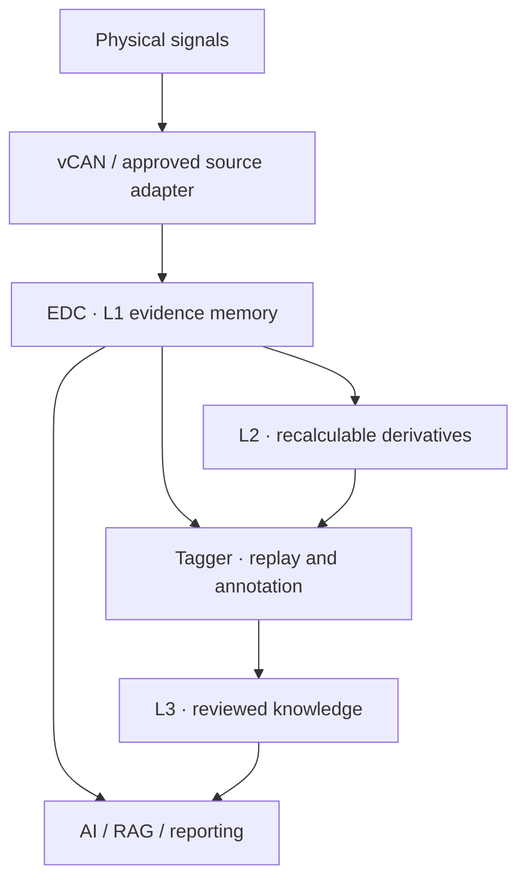

# ASNS — AI Sensory Neural System

[](https://doi.org/10.5281/zenodo.21989553)

**Evidence before inference. Replay before trust.**

ASNS is an evidence-first architecture for industrial AI. It structures channel identity, time semantics, acquisition state, source lineage, and configuration context at or before database ingestion, turning physical-world signals into traceable, replayable, and verifiable time-series evidence before the data is used by AI.

> AI needs more than data. It needs evidence.

This repository asks a foundational question: **What kind of perception and memory architecture does AI require before it can enter the physical world?**

[繁體中文](#繁體中文) · [English](#english) · [White Papers](#white-papers) · [Citation](#citation) · [Technical Notice](#technical-notice)

---

## Status of the Terms Used in This Repository

ASNS, vCAN, EDC, Tagger, and CID are author-defined technical terms used by Embodied Worker Co., Ltd. and Kangaroo TEC Corporation to describe an implemented evidence-first industrial AI architecture. They are not presented as existing international standards.

- **ASNS** is the overall sensing, evidence, and knowledge architecture.
- **vCAN** is an identity-aware sensing communication protocol and data language implemented on CAN 2.0B.
- **EDC** is the edge-side data core used to preserve and serve L1 time-series evidence.
- **Tagger** is the engineering workspace used for replay, annotation, baseline formation, and reviewed knowledge.
- **CID** is the stable identity assigned to a physical data channel.

This repository publishes architectural roles, engineering boundaries, minimum evidence requirements, and verification principles. It does not publish internal frame formats, firmware, source code, algorithms, security configurations, or other proprietary implementation details.

中文說明：ASNS、vCAN、EDC、Tagger與CID為具象職人股份有限公司及肯革陸科技用於描述Evidence-First工業AI架構及現行實作的自定義技術名稱，並非既有國際標準。本儲存庫公開其架構角色、工程邊界、最低證據要求與驗證原則，不公開內部訊框格式、韌體、原始碼、演算法、資安配置及其他專有實作細節。

## Why ASNS

Industrial IoT made machines connectable. It did not automatically make their data understandable to AI. A value and timestamp alone cannot reliably establish channel identity, event-time meaning, acquisition state, preservation of the original observation, or the evidence behind a conclusion.



## Architecture at a Glance

| Component | Public role | Explicit boundary |
|---|---|---|
| **ASNS** — AI Sensory Neural System | Overall sensing, evidence, and knowledge architecture positioned before industrial AI | Does not replace deterministic control or safety systems |
| **vCAN** — Volapük CANBUS | Identity-aware sensing and communication based on CAN 2.0B | Does not perform AI inference or equipment control |
| **EDC** — EdgeAI Data Core | Edge-side L1 evidence memory with read-only query interfaces | Is not an AI model, SCADA system, or controller |
| **Tagger** | Workspace for replay, annotation, golden baselines, and reviewed knowledge | Does not independently declare equipment failure |
| **L1** | Original acquisition records that are not overwritable through supported user interfaces | Does not claim that the sensor itself is always correct |
| **L2** | Versioned and recalculable transformations, features, and behavior models | Cannot overwrite or impersonate L1 |
| **L3** | Human-reviewed knowledge linked back to evidence | Unreviewed AI output does not automatically qualify |

The minimum public L1 record is:

```text
{CID, Timestamp, Time Semantics, Value, Acquisition State, Source Type, Configuration Version}
```

## Public Verification Conditions

An ASNS-aligned deployment should be able to demonstrate stable CID, explicit timestamp semantics, acquisition state stored with value, traceable source and configuration version, no supported path to overwrite historical L1, recalculable and versioned L2, human-reviewed L3, and AI conclusions linked to identifiable evidence.

Using CAN, Modbus, an edge database, a time-series database, or an annotation tool does not by itself establish alignment with ASNS. Conversely, an external system may follow similar Evidence-First AI principles without claiming to be an ASNS implementation.

## Design Boundaries

ASNS does **not** replace PLCs, SCADA, SIS, or deterministic high-speed control. AI does not participate in high-speed closed-loop control.

Native vCAN evidence is classified as **L1-V**. Within the currently verified standard implementation scope, approved read-only Modbus mirror data with explicit lineage is classified as **L1-S**. This is a current implementation boundary, not a claim that Modbus is inherently evidentiary. MQTT, OPC UA, BACnet, and arbitrary PLC points do not automatically qualify as L1 merely because they can be connected; any source requires an explicit adapter specification, provenance boundary, time semantics, acquisition-state mapping, configuration version, and deployment verification.

---

## 繁體中文

### ASNS是什麼

**ASNS（AI Sensory Neural System，AI感知神經系統）**是部署在物理現場與AI應用之間的證據基礎設施。它不以AI取代PLC、SCADA、SIS或高速確定性控制，也不是另一套雲端看板。ASNS的目標，是在AI進行診斷或判斷以前，先把現場資料轉化為可追溯、可回放、可驗證的時序證據。

### 五項核心原則

1. **CID是資料身分；Tag是人類可讀別名。**
2. **時間必須具有明確語意。**事件時間、接收時間與入庫時間不得混為一談。
3. **採集狀態必須與數值共同保存。**通訊異常不能被誤判為物理異常。
4. **L1在系統支援介面內對使用者不可覆寫。**修正與轉換應在具版本的L2產生。
5. **每一項判斷都必須能回到證據。**AI結論應指出CID、時間區間、資料粒度、L2版本與知識來源。

AI可以修正判斷，但不能為了符合新判斷而修改歷史證據。

---

## English

### What ASNS Is

ASNS is physical-world evidence infrastructure positioned between industrial sites and AI applications. It preserves identity, time semantics, acquisition state, provenance, and configuration context so that AI can retrieve, align, replay, and verify evidence instead of reasoning from anonymous or context-poor numbers.

### Evidence-to-Knowledge Cycle

**Evidence → replay → annotation → reviewed knowledge → decision support → action → verification**

AI may revise its interpretation. It may not revise historical evidence to make a new interpretation appear correct.

---

## White Papers

**Version 1.3 · Published August 22, 2026**

| Language | Searchable Markdown | PDF | Editable document |
|---|---|---|---|
| Traditional Chinese | [Read online](./ASNS_Public_Definition_White_Paper_v1.3_ZH-TW.md) | [Download PDF](./ASNS_Public_Definition_White_Paper_v1.3_ZH-TW.pdf) | [Download DOCX](./ASNS_Public_Definition_White_Paper_v1.3_ZH-TW.docx) |
| English | [Read online](./ASNS_Public_Definition_White_Paper_v1.3_EN.md) | [Download PDF](./ASNS_Public_Definition_White_Paper_v1.3_EN.pdf) | [Download DOCX](./ASNS_Public_Definition_White_Paper_v1.3_EN.docx) |

## Version 1.3 Changes

- Declares the status of ASNS, vCAN, EDC, Tagger, and CID as author-defined technical terms rather than existing international standards.
- Separates the ASNS architectural proposition from the current vCAN, EDC, and Tagger implementations.
- Defines public responsibilities and explicit non-responsibilities for each component.
- Adds eight minimum publicly verifiable conditions for an ASNS-aligned deployment.
- Clarifies that the current Modbus-based L1-S scope is an implementation-admission boundary, not a claim that one protocol is inherently evidentiary.
- States the public disclosure boundary without exposing internal frame formats, firmware, algorithms, source code, security configurations, or customer data.

## Citation

```text
CHUEH, P. (2026). Before AI Enters the Physical World: How ASNS Turns
Industrial Data into Replayable Time-Series Evidence (Version 1.3).
Embodied Worker Co., Ltd. https://doi.org/10.5281/zenodo.21989553
```

- **Permanent DOI for all versions:** [10.5281/zenodo.21989553](https://doi.org/10.5281/zenodo.21989553)
- A version-specific DOI may be added after the Version 1.3 Zenodo record is published.

Machine-readable citation metadata is provided in [`CITATION.cff`](./CITATION.cff).

## Keywords

ASNS, AI Sensory Neural System, vCAN, Volapük CANBUS, EDC, EdgeAI Data Core, Tagger, Evidence-First AI, Physical AI, Industrial AI, CID, Channel Identity, Event Time, Acquisition State, Time Semantics, Source Lineage, Time-Series Evidence, L1, L2, L3, Historical Replay, Auditable Knowledge, Golden Baseline, Deviation Management, Public Verification Conditions.

## Author and Publisher

- **Author:** CHUEH POHSUN（闕伯勲）
- **Publisher:** Embodied Worker Co., Ltd.（具象職人股份有限公司）
- **Technical architecture:** Kangaroo TEC Corporation（肯革陸科技有限公司）

## Technical Notice

ASNS, vCAN, EDC, Tagger, and CID are author-defined technical terms and are not presented as existing international standards. This repository publicly describes their architectural principles, public contracts, and verification boundaries. It does not constitute a complete communication protocol, product specification, performance warranty, safety-control design, or authorization to reproduce an implementation. Actual functions and sampling capabilities are governed by official product specifications, deployment design, and verification results. Internal frame formats, algorithms, firmware, source code, security configurations, customer data, and undisclosed implementation details are outside the scope of this publication.

本文使用的ASNS、vCAN、EDC、Tagger與CID為自定義技術名稱，並非既有國際標準。本儲存庫公開說明其架構原則、公開契約與驗證邊界，不構成完整通信協定、產品規格、性能保證、安全控制設計或實作授權。內部訊框格式、演算法、韌體、原始碼、資安配置、客戶資料與其他未公開實作細節不在本次公開範圍內。

See [`COPYRIGHT.md`](./COPYRIGHT.md) for the rights statement.

© 2026 Embodied Worker Co., Ltd. All rights reserved.
