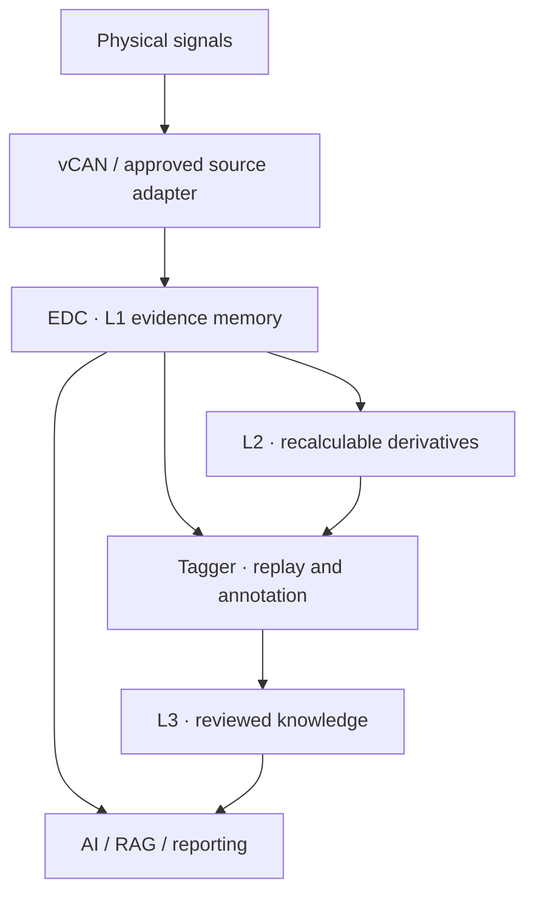

# ASNS — AI Sensory Neural System

[](https://doi.org/10.5281/zenodo.21989554)

**Evidence before inference. Replay before trust.**

ASNS is an evidence-first architecture for industrial AI. It turns physical-world signals into traceable, replayable, and verifiable time-series evidence before the data is used by AI.

> AI needs more than data. It needs evidence.

This repository raises a foundational question: **What kind of perception and memory architecture does AI require before it can enter the physical world?**

[繁體中文](#繁體中文) · [English](#english) · [White Papers](#white-papers) · [Citation](#citation) · [Technical Notice](#technical-notice)

---

## Why ASNS

Industrial IoT made machines connectable. It did not automatically make their data understandable to AI.

A value and a timestamp alone cannot reliably answer:

- Which stable physical channel produced this record?
- What does the timestamp represent: event time, reception time, or storage time?
- Was the source successfully acquired, disconnected, timed out, misconfigured, or stale?
- Was the original observation preserved after cleaning and calculation?
- Can a conclusion be replayed and independently verified?

ASNS provides the evidence layer required to answer these questions.



## Architecture at a Glance

| Component | Public role |
|---|---|
| **ASNS** — AI Sensory Neural System | The overall sensing, evidence, and knowledge architecture positioned before industrial AI |
| **vCAN** — Volapük CANBUS | Identity-aware sensing and communication based on CAN 2.0B |
| **EDC** — EdgeAI Data Core | Edge-side L1 evidence memory with read-only query interfaces |
| **Tagger** | Engineering workspace for replay, annotation, golden baselines, and reviewed knowledge formation |
| **L1** | User-immutable original acquisition records |
| **L2** | Versioned and recalculable transformations, features, and behavior models |
| **L3** | Human-reviewed knowledge linked back to evidence |

The minimum public L1 record is:

```text
{CID, Timestamp, Time Semantics, Value, Acquisition State, Source Type, Configuration Version}
```

## Design Boundaries

ASNS does **not** replace PLCs, SCADA, SIS, or deterministic high-speed control. AI does not participate in high-speed closed-loop control. ASNS preserves and serves physical-world evidence so that AI-assisted diagnosis, RAG, reporting, and engineering analysis can remain traceable.

Native vCAN evidence is classified as **L1-V**. Approved read-only Modbus mirror data with explicit lineage is classified as **L1-S**. MQTT, OPC UA, BACnet, and arbitrary PLC points do not automatically qualify as L1 merely because they can be connected.

---

## 繁體中文

### ASNS 是什麼

**ASNS（AI Sensory Neural System，AI 感知神經系統）**是部署在物理現場與 AI 應用之間的證據基礎設施。

本儲存庫公開提出一個基礎問題：**AI 進入物理世界之前，需要什麼樣的感知與記憶架構？**

它不以 AI 取代 PLC、SCADA、SIS 或高速確定性控制，也不是另一套雲端看板。ASNS 的目標，是在 AI 對物理世界進行診斷或判斷之前，先把現場資料轉化為可追溯、可回放、可驗證的時序證據。

### 五項核心原則

1. **CID 是資料身分；Tag 是人類可讀別名。**
2. **時間必須具有明確語意。**事件時間、接收時間與入庫時間不得混為一談。
3. **採集狀態必須與數值共同保存。**通訊異常不能被誤判為物理異常。
4. **L1 在系統支援介面內對使用者不可覆寫。**所有修正與轉換應在具版本的 L2 產生。
5. **每一項判斷都必須能回到證據。**AI 結論應指出使用的 CID、時間區間、資料粒度、L2 版本與知識來源。

### 分層治理

- **L1：原始採集與證據層** — 保存系統當時實際取得的紀錄與客觀採集狀態。
- **L2：可重算邏輯與行為層** — 保存轉換規則、參數、來源區間與版本。
- **L3：經審核知識層** — 保存由負責人員確認、且可追溯至證據的工程知識。

AI 可以修正判斷，但不能為了符合新判斷而修改歷史證據。

---

## English

### What ASNS Is

**ASNS — AI Sensory Neural System** is physical-world evidence infrastructure positioned between industrial sites and AI applications.

Its purpose is to preserve the identity, time semantics, acquisition state, provenance, and configuration context of observations so that AI can retrieve, align, replay, and verify evidence instead of reasoning from anonymous or context-poor numbers.

### Five Core Principles

1. **CID is data identity; a Tag is a human-readable alias.**
2. **Time must have explicit semantics.** Event time, reception time, and storage time must remain distinguishable.
3. **Acquisition state must be preserved with the value.** A communication failure must not be mistaken for a physical event.
4. **L1 is user-immutable through supported interfaces.** Corrections and transformations are produced separately as versioned L2 results.
5. **Every judgment must be able to return to evidence.** An AI conclusion should identify the CIDs, time interval, granularity, L2 version, and knowledge sources used.

### Evidence-to-Knowledge Cycle

ASNS supports a controlled cycle:

**Evidence → replay → annotation → reviewed knowledge → decision support → action → verification**

AI may revise its interpretation. It may not revise the historical evidence to make the new interpretation appear correct.

---

## White Papers

**Version 1.2 · Published August 18, 2026**

| Language | Searchable Markdown | PDF | Editable document |
|---|---|---|---|
| Traditional Chinese | [Read online](./ASNS_Public_Definition_White_Paper_v1.2_ZH-TW.md) | [Download PDF](./ASNS_Public_Definition_White_Paper_v1.2_ZH-TW.pdf) | [Download DOCX](./ASNS_Public_Definition_White_Paper_v1.2_ZH-TW.docx) |
| English | [Read online](./ASNS_Public_Definition_White_Paper_v1.2_EN.md) | [Download PDF](./ASNS_Public_Definition_White_Paper_v1.2_EN.pdf) | [Download DOCX](./ASNS_Public_Definition_White_Paper_v1.2_EN.docx) |

## Citation

```text
CHUEH, P. (2026). Before AI Enters the Physical World: How ASNS Turns
Industrial Data into Replayable Time-Series Evidence (Version 1.2).
Embodied Worker Co., Ltd. https://doi.org/10.5281/zenodo.21989554
```

- **Version 1.2 DOI:** [10.5281/zenodo.21989554](https://doi.org/10.5281/zenodo.21989554)
- **Concept DOI for all versions:** [10.5281/zenodo.21989553](https://doi.org/10.5281/zenodo.21989553)

Machine-readable citation metadata is provided in [`CITATION.cff`](./CITATION.cff).

## Keywords

ASNS, AI Sensory Neural System, vCAN, Volapük CANBUS, EDC, EdgeAI Data Core, Tagger, Evidence-First AI, Physical AI, Industrial AI, CID, Channel Identity, Event Time, Acquisition State, Time Semantics, Source Lineage, Time-Series Evidence, L1, L2, L3, Historical Replay, Auditable Knowledge, Golden Baseline, Deviation Management.

## Author and Publisher

- **Author:** CHUEH POHSUN
- **Publisher:** Embodied Worker Co., Ltd.（具象職人股份有限公司）
- **Technical architecture:** KangarooTEC

## Technical Notice

This repository publicly describes the architectural principles of ASNS, vCAN, EDC, and Tagger. It does not constitute a complete communication protocol, product specification, performance warranty, or safety-control design. Actual functions and sampling capabilities are governed by official product specifications, deployment design, and verification results. Internal frame formats, algorithms, firmware, and undisclosed implementation details are outside the scope of this publication.

本文公開說明 ASNS、vCAN、EDC 與 Tagger 的架構原則，不構成完整通信協定、產品規格、性能保證或安全控制設計。實際功能與採樣能力應以正式產品規格、部署設計及驗證結果為準。

See [`COPYRIGHT.md`](./COPYRIGHT.md) for the rights statement.

© 2026 Embodied Worker Co., Ltd. All rights reserved.
